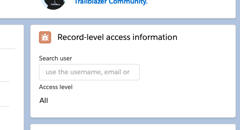
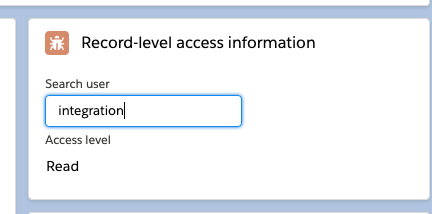

# Record Access Display

The RAD Lightning Web Component displays which users have access to the current entity. It might be useful for admins to check out which users and groups have access to the record being currently displayed.

When a record is accessed:

When the (admin) user searches for another user's access to the current record:

In this example, the "integration user" was searched (as its username is something like `integration@00d1d000000xxxxxxx.com`, and its name is "Integration User").

## Usage

Drag the Record Access Display component to the Lightning Page of an object you want.

**It is recommended that ou set it to display only for administrators.**

## Why?

Because I've become tired of questions like "but does this user have access?" in a production environment where other people have played with permissions and profiles. Hopefully with this component this type of question can easily be answered without opening the console or typing a query.

## How?

This component calls an Apex class that queries the UserRecordAccess internal object for the access to the current record.
